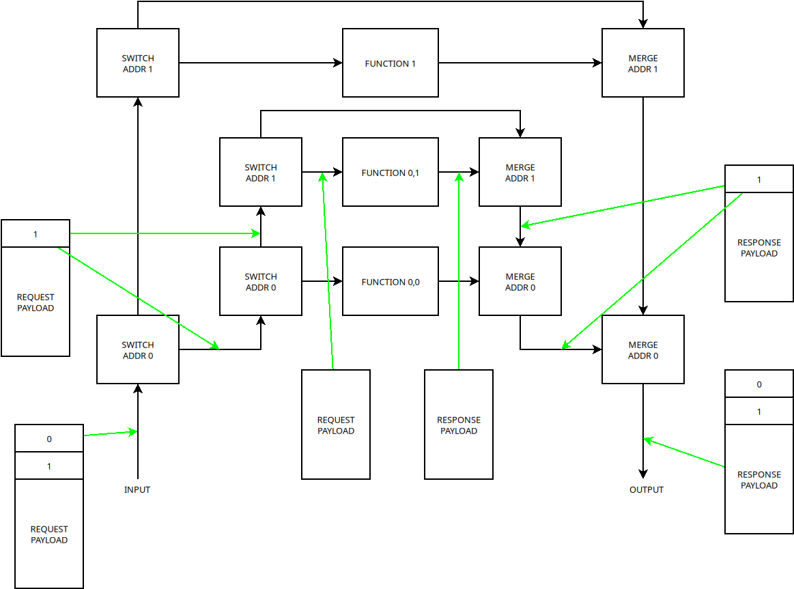
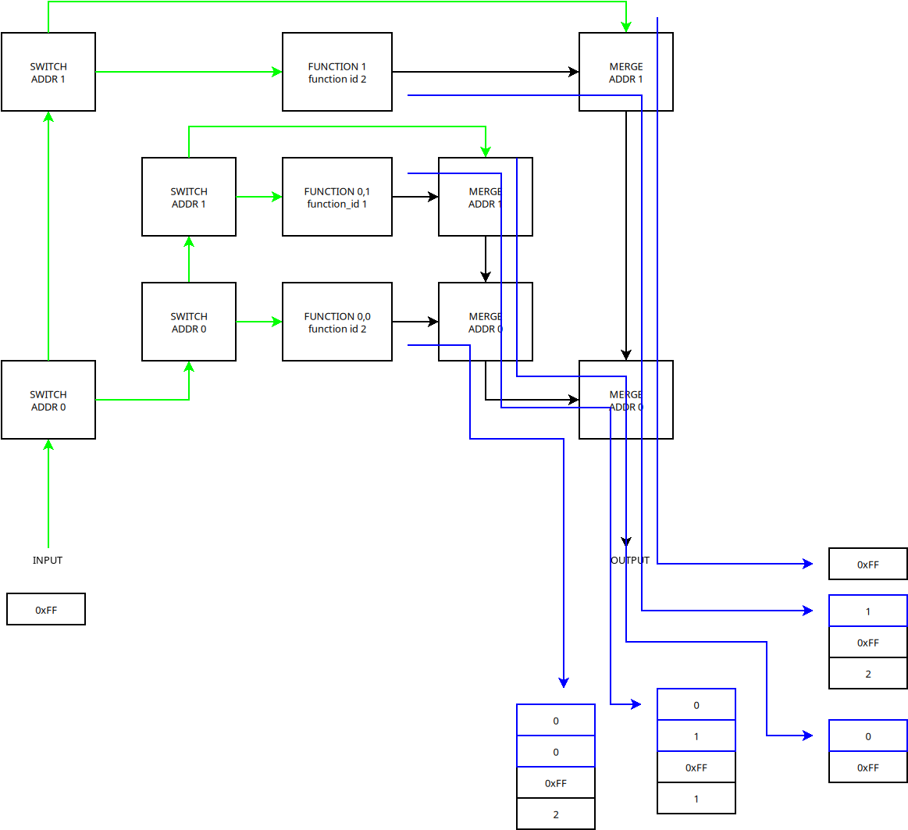

# AXI4S lite addressing with broadcast
Address words are the first words in the data stream. The basic building block of the addressed bus is axi4s_address_switch and axi4s_address_merge. 

|
|:--:| 
| Request payload through switches to function, then response payloud through merges |

As seen in the figure above if the first word of a a axi4s lite frame matches the address of the switch block, that address word will be popped of the stream and sent out to the next level of switch blocks (or function). If the first word does not match the frame will go through untouched. 

When the function generates a response it outputs the payload to a merge block, this block will push its address on to the head of the frame. If the merge gets an input from the top, it goes through unchanged to the next merge block.

Note that each level of switch/merge has a loop, this will cause request payloads with no receiver to be looped out untouched.

## Broadcast
If the switch block sees an address that is all ones (0xFF for 8 bit bus) it is interpreted as broadcast. Broadcast frames will go through to both switched and through outputs unchanged.

## Function response to broadcast
When a function receives a broadcast it responds by sending a broadcast address followed by its unique function id (by function type, all SPI-interfaces has the SPI-interface id, instances are differentiated by address). The response can be longer, but must start with broadcast address and function id, then a more detailed function description can follow. 

## Address enumeration
Enumeration is initiated by inputting a frame consisting of only the broadcast addreess (0xFF for 8 bit bus). Then the output is read and all frames shall be stored. These frames shall contain the addresses to each function. The address and description are delimited by the broadcast word. To avoid timeouts the mechanism responsible for enumeration can wait until a frame consisting of only the broadcast frame is received, and then send a second broadcast word. After this the enumeration is complete when two of each frames have been received.

Response to one broadcast frame is shwon in figure below.

|
|:--:| 
| Broadcast address is distributed and duplicated by switches and indicated by the green arrows. The blue arrows indicate addres merges for each response frame. Frame words representing addressis have blue outlines. 0xFF is address/paylod delimiter. And word below is function description|

# Addressing components

## axi4s_address_switch
Implements axi4s lite switch with broadcast.  

&nbsp;
  

Definition:  
``axi4s_address_switch(reset, clk, i, om, address, o)``

&nbsp;

|Name | Function |
|:--|:--|
|reset| reset |
|clk| clock|
|i | input axi4s lite stream
|om | if first word of stream matches address, it will be removed and output on this port.
|address | Address to compare first word in stream against|
|o | if address does not match, stream frame will be output unchanged on this port|

If a frame starts with a word that is all ones (0xFF for 8 bit word width) it will be duplicated unchanged on both the `o` and `om` ports.

## axi4s_address_merge
Implement an address merge. 

&nbsp;
  

Definition:  
``axi4s_address_merge(reset, clk, through, merge, address, o)``

&nbsp;

|Name | Function |
|:--|:--|
|reset| reset |
|clk| clock|
|through | This stream is connected to output stream o unmodified |
|merge | stream to be merged. address will be prepended to this stream and outputted on o port|
|address | Address to prepend to merge stream|
|o | output port|

## axi4s_address_branch
Represents an address branch, this component instantiates a switch and amux. It also prepends the broadcast word to output from function.

|
|:--:| 
| address_branch contains switch and merge needed to create a new addressable branch. FUNCTION block can also be another address level.|

&nbsp;
  

Definition:  
``axi4s_address_branch(reset, clk, i_prev, o_prev, i_func, o_func, funcaddr, i_next, o_next)``

&nbsp;

|Name | Function |
|:--|:--|
|reset| reset |
|clk| clock|
|i_prev | input from previous branch |
|o_prev | output to previous branch |
|i_func | output to function input|
|o_func | input for function output|
|funcaddr| address for function branch|
|i_next | input from next branch |
|o_next | output to next branch |

# AXI4S stream modifiers
This chapter contains descriptions of components that modifies axi4s lite streams.

## axi4s_appender
Append one or more words to the end of a stream.

Definition:  
``axi4s_appender(reset, clk, i, o, app)``  

&nbsp;

|Name | Function |
|:--|:--|
|reset| reset |
|clk| clock|
|i | input stream |
|o | output stream with app appended. |
|app | data to be appended. Must be multiple length of i.data|

## axi4s_prepender
Prepend one or more words to the end of a stream.  

Definition:  
``axi4s_prepender(reset, clk, i, o, prep)``  

&nbsp;

|Name | Function |
|:--|:--|
|reset| reset |
|clk| clock|
|i | input stream |
|o | output stream with prep prepended. |
|app | data to be prepended. Must be multiple length of i.data|

## axi4s_dle_encoder
Encodes axi stream using ascii code DLE with DLE STX in beginning and DLE ETX in end. the stream content is then escaped with DLE. In this way frames can be recovered after last signal is removed.  

Definition:  
``axi4s_dle_encoder(reset, clk, i, o)``  

&nbsp;

|Name | Function |
|:--|:--|
|reset| reset |
|clk| clock|
|i | input stream |
|o | output stream that has been encoded with DLE, STX and ETX.. |

## axi4s_last_escaper
adds escape sequences when escape character occurs in stream. Adds `esc end` at the end of the stream to mark end of frame.  
Definition:  
``axi4s_last_escaper(reset, clk, i, o, esc, end)``  

&nbsp;

|Name | Function |
|:--|:--|
|reset| reset |
|clk| clock|
|i | input stream |
|o | output stream that has been escaped and appended with end |
|esc| symbol used as escape character|
|end| symbol to be escaped to mark end of stream|

## axi4s_last_deescaper
Deescapes escaped stream and sets last for the word after `esc end` sequence in stream.  
Definition:  
``axi4s_last_deescaper(reset, clk, i, o, frameError, esc, end)``  

&nbsp;

|Name | Function |
|:--|:--|
|reset| reset |
|clk| clock|
|i | input stream |
|o | output stream that has been deescaped and with last asserted after `esc end`|
|frameError| asserted if escaped symbol is not `end` or `esc`| 
|esc| symbol used as escape character|
|end| symbol to be escaped to mark end of stream|

## axi4s_head_unpacker
Unpack the head of an axi stream, then when head has been handshaked the tail is transfered to ouput port.

Definition:  
``axi4s_head_unpacker(reset, clk, i, tail_out, out_regs_o, out_valid_o, readyIn, words)``  

&nbsp;

|Name | Function |
|:--|:--|
|reset| reset |
|clk| clock|
|i | input stream |
|tail_out | output stream, part that was not in header|
|regs_out_o| unpacked head of stream. Length must be multiple of i.data| 
|out_valid_o| high when regs_out_o is valid|
|readyIn| assert while out_valid_o is high to handshake a read|
|words| number of words received, to check if entire header was received|

## axi4s_packer
Pack a word in to an axi4s lite stream.

Definition:  
``axi4s_packer(reset, clk, o, in_regs, in_valid ,in_ready_o, txOne)``  

&nbsp;

|Name | Function |
|:--|:--|
|reset| reset |
|clk| clock|
|o | output stream |
|in_regs | registers to be packed into stream. Length must be multiple of o.data length|
|in_valid| valid high at the same time as packer asserts in_ready_o handshakes transfer.| 
|in_ready_o| high when packer is ready|
|txOne| transmit only the len(o.data) bits in in_regs |

## axi4s_unpacker
Unpacks an entire axi4s lite stream into a wide register.  

Definition:  
``axi4s_unpacker(reset, clk, i, out_regs_o, out_valid_o, readyIn, words, tooLong)``  

&nbsp;

|Name | Function |
|:--|:--|
|reset| reset |
|clk| clock|
|i | input stream |
|regs_out_o| unpacked head of stream. Length must be multiple of i.data| 
|out_valid_o| high when regs_out_o is valid|
|readyIn| assert while out_valid_o is high to handshake a read|
|words| number of words received, to check if entire header was received|
|tooLong| asserted if stream was longer than regs_out_o|

## axi4s_switch
Two port mux for axi streams. toA and toB are read when i.valid is asserted. transfer will not begin until exactly one of toA or toB is asserted   

Definition:  
``axi4s_switch(reset, clk, i, oa, ob, toA, toB)``  

&nbsp;

|Name | Function |
|:--|:--|
|reset| reset |
|clk| clock|
|i | input stream |
|oa| if toA is asserted stream input will be connected to this port|
|ob| if toB is asserted stream input will be connected to this port|
|toA| assert to connect stream to A port|
|toB| assert to connect stream to B port|

## axi4s_merge
Two port merge for axi streams. Inputs a and be are checked alternately and serviced in turn if data is present on both streams.

Definition:  
``axi4s_merge(reset, clk, ia, ib, o)``  

&nbsp;

|Name | Function |
|:--|:--|
|reset| reset |
|clk| clock|
|ia | input stream a |
|ib | input stream b |
|o| framse from both inpus are connected to this output|
